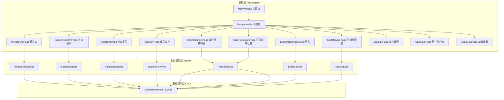
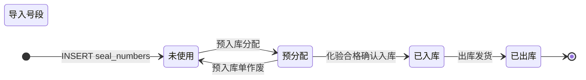

# 硅锰合金库存管理系统 - 技术设计文档

Feature Name: silicon-manganese-inventory
Updated: 2026-07-10

## 描述

基于 PySide6 + SQLite 的 PC 桌面硅锰合金库存管理系统，覆盖铅封号全程追溯、预入库、化验管理、成品入库确认、出库发货、成品库存、每日发货明细及订单装车汇总等 14 个功能需求。

## 架构

### 整体架构



### 铅封号状态机



## 数据模型

### 数据库表结构

#### 1. 铅封号 (seal_numbers)

| 字段 | 类型 | 说明 |
|------|------|------|
| id | INTEGER PK | 主键 |
| seal_code | TEXT UNIQUE NOT NULL | 铅封号（如 0000014101） |
| seal_batch_id | INTEGER FK | 关联号段 ID |
| status | TEXT NOT NULL | 状态：unused / pre_allocated / in_stock / shipped |
| pre_inbound_id | INTEGER FK | 预入库单 ID |
| inbound_id | INTEGER FK | 入库单 ID |
| outbound_id | INTEGER FK | 出库单 ID |
| batch_no | TEXT | 批次号 |
| location_code | TEXT | 库位编号 |
| created_at | TEXT | 创建时间 |
| updated_at | TEXT | 更新时间 |

#### 2. 铅封号段 (seal_batches)

| 字段 | 类型 | 说明 |
|------|------|------|
| id | INTEGER PK | 主键 |
| name | TEXT | 号段名称 |
| start_code | TEXT NOT NULL | 起始铅封号 |
| end_code | TEXT NOT NULL | 结束铅封号 |
| total_count | INTEGER | 总数量 |
| import_date | TEXT | 导入日期 |

#### 3. 预入库单 (pre_inbound_orders)

| 字段 | 类型 | 说明 |
|------|------|------|
| id | INTEGER PK | 主键 |
| order_no | TEXT UNIQUE | 预入库单号 |
| date | TEXT NOT NULL | 日期 |
| batch_no | TEXT NOT NULL | 批次号 |
| spec_id | INTEGER FK | 品名规格 ID |
| quantity | REAL NOT NULL | 数量（吨） |
| location_code | TEXT | 库位编号 |
| seal_batch_id | INTEGER FK | 铅封号段 ID |
| seal_start | TEXT | 分配的起始铅封号 |
| seal_end | TEXT | 分配的结束铅封号 |
| lab_status | TEXT DEFAULT 'pending' | pending / tested |
| operator | TEXT | 操作人 |
| remark | TEXT | 备注 |
| created_at | TEXT | 创建时间 |
| updated_at | TEXT | 更新时间 |

#### 4. 入库单 (inbound_orders)

| 字段 | 类型 | 说明 |
|------|------|------|
| id | INTEGER PK | 主键 |
| order_no | TEXT UNIQUE | 入库单号 |
| pre_inbound_id | INTEGER FK | 来源预入库单 ID |
| date | TEXT NOT NULL | 入库确认日期 |
| batch_no | TEXT | 批次号 |
| spec_id | INTEGER FK | 品名规格 ID |
| quantity | REAL | 数量（吨） |
| location_code | TEXT | 库位编号 |
| operator | TEXT | 操作人 |
| created_at | TEXT | 创建时间 |

#### 5. 化验结果 (lab_results)

| 字段 | 类型 | 说明 |
|------|------|------|
| id | INTEGER PK | 主键 |
| pre_inbound_id | INTEGER FK UNIQUE | 预入库单 ID |
| mn_content | REAL | Mn含量(%) |
| si_content | REAL | Si含量(%) |
| c_content | REAL | C含量(%) |
| s_content | REAL | S含量(%) |
| p_content | REAL | P含量(%) |
| mn_result | TEXT | Mn 判定：合格/不合格 |
| si_result | TEXT | Si 判定 |
| c_result | TEXT | C 判定 |
| s_result | TEXT | S 判定 |
| p_result | TEXT | P 判定 |
| overall_result | TEXT | 综合判定：合格/不合格 |
| test_date | TEXT | 化验日期 |
| remark | TEXT | 备注 |

#### 6. 出库单 (outbound_orders)

| 字段 | 类型 | 说明 |
|------|------|------|
| id | INTEGER PK | 主键 |
| order_no | TEXT UNIQUE | 出库单号 |
| date | TEXT NOT NULL | 出库日期 |
| customer_id | INTEGER FK | 客户 ID |
| sales_order_no | TEXT | 销售订单号 |
| spec_id | INTEGER FK | 品名规格 ID |
| quantity | REAL | 数量（吨） |
| batch_nos | TEXT | 涉及的批次号（逗号分隔） |
| seal_start | TEXT | 起始铅封号 |
| seal_end | TEXT | 结束铅封号 |
| operator | TEXT | 操作人 |
| remark | TEXT | 备注 |
| created_at | TEXT | 创建时间 |

#### 7. 每日发货明细 (daily_shipments)

| 字段 | 类型 | 说明 |
|------|------|------|
| id | INTEGER PK | 主键 |
| seq_no | INTEGER | 序号 |
| shipment_date | TEXT | 发货日期 |
| plate_no | TEXT | 车牌号 |
| customer_code | TEXT | 客户代码 |
| customer_name | TEXT | 客户名称 |
| sales_order_no | TEXT | 销售订单号 |
| material_name | TEXT | 物料名称 |
| spec | TEXT | 规格 |
| batch_no | TEXT | 批次号 |
| load_quantity | REAL | 装车吨数 |
| gross_weight | REAL | 毛重 |
| tare_weight | REAL | 皮重 |
| net_weight | REAL | 净重 |
| customer_received_weight | REAL | 客户收货净重 |
| seal_codes | TEXT | 铅封号明细 |
| remark | TEXT | 备注 |
| outbound_id | INTEGER FK | 关联出库单 ID |
| created_at | TEXT | 创建时间 |

#### 8. 销售订单 (sales_orders)

| 字段 | 类型 | 说明 |
|------|------|------|
| id | INTEGER PK | 主键 |
| order_no | TEXT NOT NULL | 销售订单号 |
| line_no | TEXT | 销售订单行号 |
| customer_code | TEXT | 客户代码 |
| customer_name | TEXT | 客户名称 |
| contract_ref | TEXT | 合同参考 |
| contract_no | TEXT | 销售合同号 |
| material_code | TEXT | 物料编码 |
| material_desc | TEXT | 物料描述 |
| delivery_start | TEXT | 交货开始日期 |
| delivery_end | TEXT | 交货截止日期 |
| delivery_address | TEXT | 送货地址 |
| quantity | REAL | 订单数量 |
| unit | TEXT | 单位 |
| factory_code | TEXT | 工厂代码 |
| factory_name | TEXT | 工厂名称 |
| pickup_method | TEXT | 提货方式 |
| created_at | TEXT | 创建时间 |

#### 9. 客户 (customers)

| 字段 | 类型 | 说明 |
|------|------|------|
| id | INTEGER PK | 主键 |
| code | TEXT UNIQUE | 客户代码 |
| name | TEXT NOT NULL | 客户名称 |
| contact_person | TEXT | 联系人 |
| contact_phone | TEXT | 联系电话 |
| address | TEXT | 地址 |
| remark | TEXT | 备注 |

#### 10. 供应商 (suppliers)

| 字段 | 类型 | 说明 |
|------|------|------|
| id | INTEGER PK | 主键 |
| code | TEXT UNIQUE | 供应商代码 |
| name | TEXT NOT NULL | 供应商名称 |
| contact_person | TEXT | 联系人 |
| contact_phone | TEXT | 联系电话 |
| address | TEXT | 地址 |
| remark | TEXT | 备注 |

#### 11. 库位 (locations)

| 字段 | 类型 | 说明 |
|------|------|------|
| id | INTEGER PK | 主键 |
| code | TEXT UNIQUE NOT NULL | 库位编号（如 A01） |
| name | TEXT | 库位描述 |
| warehouse_id | INTEGER FK | 所属仓库 |
| status | TEXT DEFAULT 'active' | active / inactive |
| remark | TEXT | 备注 |

#### 12. 仓库 (warehouses)

| 字段 | 类型 | 说明 |
|------|------|------|
| id | INTEGER PK | 主键 |
| name | TEXT NOT NULL | 仓库名称 |
| address | TEXT | 地址 |
| remark | TEXT | 备注 |

#### 13. 品名规格 (specs)

| 字段 | 类型 | 说明 |
|------|------|------|
| id | INTEGER PK | 主键 |
| name | TEXT UNIQUE NOT NULL | 规格名称（如 FeMn65Si17） |
| mn_content | REAL | 标准 Mn 含量 |
| si_content | REAL | 标准 Si 含量 |
| remark | TEXT | 备注 |

#### 14. 工厂 (factories)

| 字段 | 类型 | 说明 |
|------|------|------|
| id | INTEGER PK | 主键 |
| code | TEXT | 工厂代码 |
| name | TEXT NOT NULL | 工厂名称 |
| remark | TEXT | 备注 |

#### 15. 化验标准 (lab_standards)

| 字段 | 类型 | 说明 |
|------|------|------|
| id | INTEGER PK | 主键 |
| element | TEXT NOT NULL | 元素名称（Mn/Si/C/S/P） |
| min_value | REAL | 含量下限 |
| max_value | REAL | 含量上限 |
| remark | TEXT | 备注 |

### 视图（用于查询）

#### 成品库存视图 (v_inventory)

```sql
SELECT 
    i.batch_no,
    i.location_code,
    COUNT(s.id) AS balance,
    MAX(i.date) AS last_inbound_date
FROM seal_numbers s
JOIN inbound_orders i ON s.inbound_id = i.id
WHERE s.status = 'in_stock'
GROUP BY i.batch_no, i.location_code
```

#### 订单装车汇总视图 (v_order_summary)

```sql
SELECT 
    so.order_no,
    so.customer_code,
    so.customer_name,
    so.material_desc,
    so.quantity AS order_quantity,
    so.delivery_end,
    so.pickup_method,
    COALESCE(SUM(ds.load_quantity), 0) AS shipped_quantity,
    so.quantity - COALESCE(SUM(ds.load_quantity), 0) AS pending_quantity
FROM sales_orders so
LEFT JOIN daily_shipments ds ON so.order_no = ds.sales_order_no
GROUP BY so.order_no
```

## 模块组件设计

### 项目目录结构

```
silicon_manganese_inventory/
├── main.py                    # 应用入口
├── config.py                  # 配置（数据库路径等）
│
├── ui/                        # 界面层
│   ├── main_window.py         # 主窗口（导航+工作区栈）
│   ├── navbar.py              # 导航栏组件
│   ├── base_page.py           # 页面基类（搜索栏+表格+分页模式）
│   ├── pre_inbound_page.py    # 预入库页面
│   ├── inbound_confirm_page.py # 成品入库确认页面
│   ├── outbound_page.py       # 出库发货页面
│   ├── inventory_page.py      # 成品库存页面
│   ├── daily_shipment_page.py # 每日发货明细页面
│   ├── order_summary_page.py  # 订单装车汇总页面
│   ├── excel_import_page.py   # Excel导入页面
│   ├── seal_manage_page.py    # 铅封号管理页面
│   ├── location_page.py       # 库位管理页面
│   ├── customer_page.py       # 客户供应商页面
│   ├── basic_data_page.py     # 基础数据页面
│   └── dialogs/               # 对话框
│       ├── pre_inbound_dialog.py
│       ├── lab_result_dialog.py
│       ├── outbound_dialog.py
│       ├── seal_batch_dialog.py
│       └── excel_preview_dialog.py
│
├── services/                  # 业务逻辑层
│   ├── seal_service.py        # 铅封号分配/状态变更
│   ├── inbound_service.py     # 预入库 + 入库确认
│   ├── outbound_service.py    # 出库逻辑
│   ├── inventory_service.py   # 库存查询
│   ├── lab_service.py         # 化验结果录入/判定
│   ├── report_service.py      # 报表生成/汇总
│   ├── excel_service.py       # Excel 导入/导出
│   └── export_service.py      # 通用导出
│
├── dao/                       # 数据访问层
│   ├── database.py            # 数据库连接管理 + 建表
│   ├── seal_dao.py
│   ├── inbound_dao.py
│   ├── outbound_dao.py
│   ├── inventory_dao.py
│   ├── customer_dao.py
│   ├── location_dao.py
│   ├── spec_dao.py
│   ├── sales_order_dao.py
│   ├── daily_shipment_dao.py
│   └── lab_dao.py
│
├── models/                    # 数据模型
│   ├── seal.py
│   ├── inbound.py
│   ├── outbound.py
│   ├── customer.py
│   ├── location.py
│   └── sales_order.py
│
└── utils/                     # 工具类
    ├── date_utils.py          # 日期格式化/解析
    ├── number_utils.py        # 铅封号编号递增/格式化
    └── excel_utils.py         # Excel 读写工具
```

### 核心业务逻辑

#### 预入库分配铅封号算法 (SealService.assign_seals)

```
输入: seal_batch_id, quantity
处理:
  1. 查询该号段下所有 status='unused' 的铅封号，按 seal_code ASC 排序
  2. 取前 quantity 条
  3. 批量更新 status='pre_allocated', 写入 pre_inbound_id/batch_no/location_code
  4. 返回分配的铅封号列表 (起始号, 结束号, 各编号)
输出: (seal_start, seal_end, count, seal_codes[])
校验: IF 可用数量 < quantity THEN 抛出 SealInsufficientError
```

#### 出库自动选取铅封号算法 (OutboundService.pick_seals)

```
输入: spec_id, location_code, quantity
处理:
  1. 查询 status='in_stock' 且关联该品名规格/库位的铅封号，按 seal_code ASC 排序
  2. 取前 quantity 条
  3. 批量更新 status='shipped', 写入 outbound_id
输出: (seal_start, seal_end, count, seal_codes[])
校验: IF 可用数量 < quantity THEN 抛出 StockInsufficientError
```

#### 化验结果自动判定 (LabService.judge)

```
输入: lab_result (Mn/Si/C/S/P 含量)
处理:
  1. 从 lab_standards 表读取各元素合格范围
  2. 逐元素对比: IF min_value <= content <= max_value THEN 合格 ELSE 不合格
  3. 综合判定: IF 所有元素均合格 THEN 合格 ELSE 不合格
  4. 生成格式化化验字符串
输出: (element_results[], overall_result, formatted_string)
```

## 正确性约束

1. **铅封号唯一性**: seal_code 在 seal_numbers 表中 UNIQUE 约束，物理保证不重复
2. **号段不重叠**: 导入号段时程序校验 start_code/end_code 不与已有号段交叉
3. **库存一致性**: 出入库操作在同一事务中执行铅封号状态变更和库存计数更新
4. **铅封号状态流转**: service 层校验状态流转合法性（如不能从 'unused' 直接跳到 'shipped'）
5. **入库后不可变**: inbound_orders 表无 EDIT/UPDATE API，仅允许查询和通过预入库单创建

## 错误处理策略

| 场景 | 处理方式 |
|------|---------|
| 号段剩余不足 | 弹出 QMessageBox 警告，阻止提交，提示可用数量 |
| 库存不足 | 弹出 QMessageBox 警告，阻止出库，显示当前可用吨数 |
| 铅封号状态异常 | 回滚事务，记录错误日志，弹出错误提示 |
| Excel格式不符 | 解析阶段逐行验证，弹出错误列表（哪行哪列格式错误） |
| 删除有库存的库位 | 弹出提示"该库位存在库存记录，无法删除" |
| 数据库连接失败 | 弹出提示并退出，记录日志 |

## 测试策略

1. **单元测试**: 对 services 层的 seal/inbound/outbound/lab 服务编写 pytest 用例，覆盖正常流程和边界条件
2. **集成测试**: 测试数据库 dao 层的 CRUD 操作正确性
3. **状态机测试**: 铅封号状态流转的合法性组合测试
4. **UI 测试**: 关键页面的表单验证、数据展示正确性可进行手动回归测试

## 外部依赖

| 依赖 | 版本 | 用途 |
|------|------|------|
| PySide6 | >=6.5 | GUI 框架 |
| openpyxl | >=3.1 | Excel 读写 |
| pytest | >=7.0 | 单元测试 |

## 参考文献

[^1]: PySide6 官方文档 - https://doc.qt.io/qtforpython-6/
[^2]: SQLite 文档 - https://www.sqlite.org/docs.html
