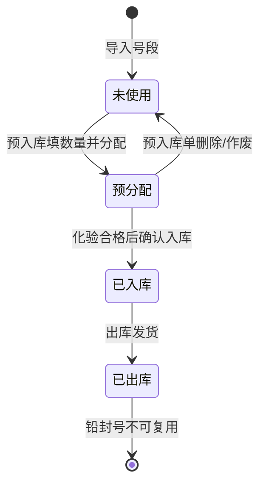

# 硅锰合金库存管理系统 - 需求文档

## 引言

本系统为 PC 桌面应用，面向硅锰合金贸易/生产企业的仓库管理人员，提供铅封号全程追溯、预入库、化验管理、成品入库、出库发货、多库位管理、销售订单导入、每日发货明细、成品库存报表及订单装车汇总等核心功能。采用 PySide6 构建桌面 GUI，SQLite 作为本地数据存储。

## 术语表

| 术语 | 定义 |
|------|------|
| 硅锰合金 | 锰和硅组成的铁合金，主要用作炼钢脱氧剂和合金添加剂 |
| 吨包袋 | 装载硅锰合金的包装袋，每袋盛装一吨合金 |
| 铅封号 | 封住吨包袋的铅封上的唯一编号，用于追溯每袋合金的去向 |
| 铅封号段 | 一组连续的铅封号范围，由管理员预先导入系统 |
| 铅封号状态 | 铅封号生命周期：未使用 → 预分配（预入库）→ 已入库（成品确认）→ 已出库（不可复用） |
| 未使用铅封号库 | 号段中尚未被分配使用的铅封号集合，入库分配时从此库选取 |
| 已使用铅封号库 | 已完成出库的铅封号集合，不可再分配复用 |
| 预入库 | 生产批次完成破碎加工后，进入成品库前，先记录批次、数量、库位并预分配铅封号的环节 |
| 批次号 | 生产批次编号，如 1226062111、1126062211，在预入库时录入 |
| 库位 | 仓库内的具体存放位置，如 A01、A02、A03 等，用户可自定义新增 |
| 化验指标 | 成品质量检测结果，包含 Mn含量(%)、Si含量(%)、C含量(%)、S含量(%)、P含量(%) 及合格判定 |
| 成品入库确认 | 化验结果合格后，确认预入库记录为正式库存的环节，确认后铅封号不可修改 |
| 销售订单 | 客户下达的采购订单，包含客户、物料、数量、交货日期等信息 |
| 每日发货明细 | 按日汇总的发货记录表，整合了订单信息、车辆信息和过磅数据 |
| 订单装车汇总 | 按销售订单维度汇总已发货量、待发货量、完成率的统计表 |
| 成品库存报表 | 按批次+库位展示的在库成品清单，包含入库日期、批次、结存、库位、化验指标 |
| 客户 | 购买硅锰合金的下游企业 |
| 供应商 | 提供硅锰合金原材料的上游企业 |
| 工厂 | 硅锰合金的生产工厂，如包头硅锰工厂 |
| 仓库 | 存放硅锰合金的物理仓储位置 |

## 铅封号生命周期

## 需求

### 需求 1：基础框架与主界面

**用户故事：** 作为仓库管理员，我希望启动应用后能看到统一的主界面，以便快速导航到各功能模块。

#### 验收标准

1. 系统启动时 SHALL 显示主窗口，包含顶部导航栏和中央工作区。
2. 导航栏 SHALL 包含「预入库」「成品入库确认」「出库发货」「成品库存」「每日发货明细」「订单装车汇总」「Excel导入」「铅封号管理」「库位管理」「客户/供应商」「基础数据」十一个模块入口。
3. 点击导航栏模块时，中央工作区 SHALL 切换为对应功能页面。
4. 主窗口状态栏 SHALL 显示当前日期、总库存吨数和已用铅封号数量。

---

### 需求 2：预入库管理

**用户故事：** 作为仓库管理员，我希望在成品破碎加工完成后进行预入库登记，系统自动分配铅封号，等待化验结果出来后再确认入库。

#### 验收标准

1. 预入库页面 SHALL 显示预入库记录列表，包含：预入库单号、日期、批次号、数量(吨)、库位、分配的铅封号范围、化验状态、操作人。
2. WHEN 用户点击「新增预入库」按钮，系统 SHALL 弹出预入库表单。
3. 预入库表单 SHALL 包含：日期（默认当天）、批次号（必填）、品名规格（下拉选择）、数量(吨)（必填）、库位（下拉选择，可自定义新增）、操作人、备注。
4. 预入库表单 SHALL 包含「铅封号段」选择区域：用户从已导入的未使用号段中选择一个号段。
5. WHEN 用户输入数量后，系统 SHALL 自动计算并展示将分配的铅封号范围（如「34 吨，分配号段：0000014101 ~ 0000014134」），校验号段剩余数量是否充足。
6. IF 所选铅封号段剩余不足，系统 SHALL 提示「号段剩余不足，请选择其他号段」并阻止。
7. WHEN 用户提交预入库表单，系统 SHALL 校验必填字段，保存预入库记录，并为每一吨生成一条铅封号预分配记录（预入库单号 + 铅封号 + 批次号 + 库位）。
8. 铅封号状态 SHALL 从「未使用」变更为「预分配」。
9. 预入库记录 SHALL 支持编辑/删除（删除或作废时铅封号状态回退为「未使用」）。
10. 预入库列表 SHALL 支持按日期范围、批次号、库位和铅封号搜索筛选。
11. 化验状态 SHALL 初始显示为「待化验」。

---

### 需求 3：化验结果管理

**用户故事：** 作为仓库管理员，我希望录入化验结果，以便判断预入库批次是否合格、能否确认入库。

#### 验收标准

1. 预入库记录中每条 SHALL 提供「录入化验结果」按钮或入口。
2. 化验结果表单 SHALL 包含：Mn含量(%)、Si含量(%)、C含量(%)、S含量(%)、P含量(%)、综合判定（合格/不合格）、化验日期、备注。
3. 综合判定 SHALL 支持手动选择合格/不合格，或根据预定义的各元素合格范围自动判定。
4. 化验结果 SHALL 以格式化字符串存储在记录中（如「Mn含量:66.9%(合格) | Si含量:17.6%(合格) | C含量:1.69%(合格) | S含量:0.0222%(合格) | P含量:0.068%(合格)」）。
5. WHEN 化验结果录入后，预入库记录的化验状态 SHALL 更新为「已化验」。
6. 化验结果 SHALL 支持后续修改更新。

---

### 需求 4：成品入库确认

**用户故事：** 作为仓库管理员，我希望在化验合格后将预入库记录确认为正式入库，铅封号从此不可修改。

#### 验收标准

1. 成品入库确认页面 SHALL 显示化验状态为「已化验」且综合判定为「合格」的预入库记录列表。
2. WHEN 用户选择一条预入库记录并点击「确认入库」，系统 SHALL 将该记录转移至成品库存。
3. 成品入库后 SHALL 生成正式的入库单号并写入成品库存表。
4. WHEN 入库确认完成，系统 SHALL 将铅封号状态从「预分配」变更为「已入库」，此后铅封号 SHALL 不可修改、不可退回。
5. 成品库存 SHALL 按批次号+库位维度累加结存吨数。
6. 不合格的预入库记录 SHALL 显示在单独的「不合格」标签页中，支持驳回/退回处理。

---

### 需求 5：成品库存管理

**用户故事：** 作为仓库管理员，我希望随时查看成品库存状况，按批次和库位掌握库存明细。

#### 验收标准

1. 成品库存页面 SHALL 以表格形式展示库存明细（对应成品库存 Excel）：入库日期、批次号、结存(吨)、库位、化验指标、备注。
2. 库存列表 SHALL 支持按批次号、库位、日期范围筛选和搜索。
3. 系统 SHALL 显示各库位库存小计和总库存吨数汇总。
4. 系统 SHALL 点击批次号展开查看该批次下所有铅封号明细及其状态。
5. WHEN 库存数量低于预设警戒线，该行 SHALL 以红色高亮显示。
6. 成品库存报表 SHALL 支持导出为 Excel 文件。

---

### 需求 6：出库发货管理

**用户故事：** 作为仓库管理员，我希望出库发货时只需填写吨数，系统自动按铅封号顺序选取并生成出库单。

#### 验收标准

1. 出库发货页面 SHALL 显示出库单列表，包含：出库单号、日期、仓库、客户、销售订单号、品名规格、吨数、铅封号明细、操作人。
2. WHEN 用户点击「新增出库」按钮，系统 SHALL 弹出出库表单。
3. 出库表单 SHALL 包含：出库日期（默认当天）、客户（下拉选择）、销售订单号（下拉选择）、品名规格、数量(吨)、操作人、备注。
4. WHEN 用户选择销售订单号，系统 SHALL 自动填充客户和品名规格信息。
5. WHEN 用户填写出库数量并确认提交，系统 SHALL 按铅封号从小到大的顺序，自动从在库成品中选取对应数量的吨包袋。
6. 系统 SHALL 在提交前展示将出库的铅封号清单供用户确认。
7. IF 库存数量不足，系统 SHALL 提示「库存不足，当前可用 X 吨」并阻止出库。
8. 出库单列表 SHALL 支持按日期范围、客户、销售订单号和铅封号搜索筛选。
9. WHEN 出库单保存成功，系统 SHALL 将铅封号状态从「已入库」变更为「已出库」。
10. 已出库的铅封号 SHALL 进入「已使用铅封号库」，不可再次分配使用。
11. 出库单详情 SHALL 支持查看铅封号明细列表。

---

### 需求 7：每日发货明细

**用户故事：** 作为仓库管理员，我希望有每日发货明细表，整合出库信息、车辆信息和过磅数据，便于日常对账和导出 Excel。

#### 验收标准

1. 每日发货明细页面 SHALL 以表格形式展示，包含以下列（对应发货记录 Excel）：
   - 序号、发货日期、车牌号、客户代码、客户名称、销售订单号
   - 物料名称、规格、批次号、装车吨数
   - 毛重、皮重、净重、客户收货净重
   - 铅封号明细、备注
2. 系统 SHALL 支持手动新增发货明细行，或导入 Excel 批量填充。
3. 用户 SHALL 可以编辑客户收货净重和备注字段。
4. 每日发货明细列表 SHALL 支持按日期范围、客户、销售订单号、车号筛选。
5. 每日发货明细 SHALL 支持导出为 Excel 文件。

---

### 需求 8：订单装车汇总

**用户故事：** 作为仓库管理员，我希望按销售订单维度查看发货进度，包括已发吨数、待发吨数和完成率。

#### 验收标准

1. 订单装车汇总页面 SHALL 以表格形式展示（对应成品数据报表 Excel 中的订单装车汇总表），包含以下列：
   - 序号、客户代码、客户名称、订单号、物料名称、规格、单位
   - 订单量、交货截止日期
   - 当日发货车数/吨数、当月发货车数/吨数
   - 累计已发量、待发量、完成率
   - 提货方式、发货进度预警
2. 系统 SHALL 根据每日发货明细自动汇总生成装车汇总数据。
3. 完成率 SHALL 以百分比显示，根据已发量/订单量计算。
4. 发货进度预警 SHALL 根据完成率和交货截止日期自动判断：即将发完、接近总量提醒、超期未完成等状态。
5. 订单装车汇总 SHALL 支持导出为 Excel 文件。

---

### 需求 9：Excel 导入管理

**用户故事：** 作为仓库管理员，我希望导入销售订单 Excel 和日发货流水 Excel，系统自动提取客户、订单、物料信息，减少手工录入。

#### 验收标准

##### 9.1 销售订单导入

1. Excel导入页面 SHALL 提供「导入销售订单 Excel」功能入口，支持选择 .xlsx/.xls 文件。
2. 销售订单 Excel SHALL 包含：销售订单号、客户代码、客户名称、物料编码、物料描述、交货开始日期、交货截止日期、数量、工厂名称、提货方式。
3. WHEN 用户导入订单 Excel，系统 SHALL 逐行解析并：
   - IF 客户代码不存在，自动创建客户记录
   - IF 物料描述（品名规格）不存在，自动创建品名规格记录
   - 保存订单数据
4. 导入完成后 SHALL 展示摘要：新增客户 X 个、新增规格 Y 个、导入订单 N 条。

##### 9.2 日发货流水导入

5. Excel导入页面 SHALL 提供「导入日发货流水 Excel」功能入口。
6. 日发货流水表 SHALL 包含：序号、发货日期、车牌、客户代码、客户名称、销售订单号、物料名称、规格、批次号、装车量、毛重、皮重、净重。
7. 导入后 SHALL 自动填充至每日发货明细页面。

---

### 需求 10：铅封号管理

**用户故事：** 作为仓库管理员，我希望管理铅封号段和铅封号生命周期，包括未使用铅封号库和已使用铅封号库。

#### 验收标准

1. 铅封号管理页面 SHALL 包含「号段管理」「未使用铅封号库」「已使用铅封号库」三个标签页。
2. 号段管理页面 SHALL 展示已导入号段：号段名称、起始编号、结束编号、总数量、已分配数量、剩余数量、导入日期。
3. WHEN 用户点击「导入号段」，系统 SHALL 弹出导入表单（起始编号、结束编号、号段名称可选）。
4. 导入时 SHALL 校验号段不重叠，并在数据库中生成所有铅封号记录，初始状态为「未使用」。
5. 未使用铅封号库 SHALL 展示所有当前可分配使用的铅封号，按编号排序。
6. 已使用铅封号库 SHALL 展示所有已出库的铅封号，含关联的预入库单号、入库单号、出库单号，支持按状态、日期追溯查询。
7. 系统 SHALL 允许删除完全未使用的号段，已部分使用的号段不可删除。

---

### 需求 11：库位管理

**用户故事：** 作为仓库管理员，我希望管理仓库内的库位信息，并支持自定义新增库位，以便准确记录成品存放位置。

#### 验收标准

1. 库位管理页面 SHALL 以列表形式展示所有库位：库位编号（如 A01、A02）、库位名称/描述、所属仓库、状态。
2. WHEN 用户点击「新增库位」，系统 SHALL 弹出库位信息表单。
3. 库位表单 SHALL 包含：库位编号（必填）、名称/描述、所属仓库、备注。
4. 系统 SHALL 允许编辑和删除已有库位。
5. IF 库位下存在库存记录，系统 SHALL 阻止删除并提示。
6. 预入库和库存查询中的库位下拉 SELECT 从该管理列表加载。

---

### 需求 12：客户/供应商管理

**用户故事：** 作为仓库管理员，我希望维护客户和供应商的基本信息，以便在出库时快速选择。

#### 验收标准

1. 客户/供应商页面 SHALL 包含「客户管理」和「供应商管理」两个标签页。
2. 客户列表 SHALL 显示：客户代码、公司名称、联系人、联系电话、地址、备注。
3. WHEN 用户点击「新增客户」或「新增供应商」，系统 SHALL 弹出信息表单。
4. 客户表单 SHALL 包含：客户代码、公司名称（必填）、联系人、联系电话、地址、备注。
5. 系统 SHALL 支持编辑和删除已有记录。

---

### 需求 13：基础数据管理

**用户故事：** 作为仓库管理员，我希望管理品名规格、工厂等基础数据。

#### 验收标准

1. 基础数据页面 SHALL 包含「品名规格」「工厂管理」「化验标准」三个标签页。
2. 品名规格 SHALL 预置 FeMn65Si17(普碳锰硅合金) 等常见规格，支持新增、编辑、删除。
3. 化验标准 SHALL 支持定义各元素的合格范围（Mn、Si、C、S、P 的上限/下限），用于化验结果自动判定。

---

### 需求 14：数据持久化与初始化

**用户故事：** 作为系统管理员，我希望系统首次启动时自动创建数据库，无需手动配置。

#### 验收标准

1. 系统首次启动时 SHALL 在应用数据目录自动创建 SQLite 数据库和全部表结构。
2. 系统 SHALL 预置常见硅锰合金品名规格数据。
3. 系统 SHALL 支持数据库备份和从备份文件恢复功能。
